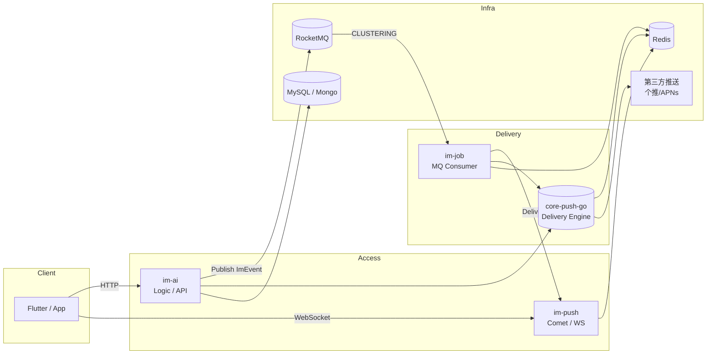
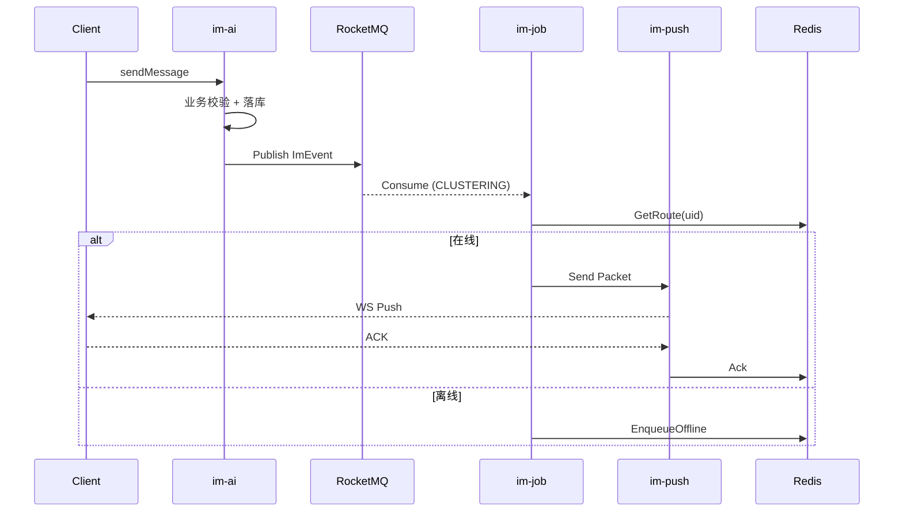

# IM 平台总体架构设计（Project Level）

> 面向：技术负责人 / 架构评审 / 团队统一认知  
> 目标规模：**50 万在线用户**  
> 技术栈：Go + RocketMQ + Redis + WebSocket（GOIM 思路）

---

## 1. 架构目标与设计原则

### 1.1 架构目标
- 支撑 **50W 长连接在线**
- 消息低延迟、可扩展、可回溯
- 清晰拆分职责，避免单点巨石服务
- 允许业务快速扩展（群、机器人、红包、音视频等）

### 1.2 核心设计原则（红线）
1. **连接层（Comet）不做业务**
2. **MQ 只负责事件传递，不负责重试/离线**
3. **所有投递一致性由 Delivery Engine 保证**
4. **禁止广播消费 MQ**
5. **库优先（Library-first），服务只是运行载体**

---

## 2. 全局系统架构图

---

## 3. 服务职责划分（非常重要）

### 3.1 im-ai（Logic / API）
**职责**
- 登录鉴权、关系校验
- 消息业务处理（好友 / 群 / 撤回 / 红包等）
- 消息落库（历史）
- 生成 `ImEvent` 并发布 MQ

**不做**
- WebSocket
- 在线路由
- 消息投递

---

### 3.2 im-push（Comet / 长连接网关）
**职责**
- WebSocket 建连与心跳
- 维护本地 `uid -> conn`
- 向 Redis 写入 `uid -> cometAddr`
- 向客户端下发消息
- 接收 ACK

**不做**
- MQ 消费
- 离线 / 重试
- 第三方推送

---

### 3.3 im-job（投递服务）
**职责**
- RocketMQ **CLUSTERING** 消费
- 根据 `uid -> cometAddr` 定向投递
- 投递失败写入离线
- 触发第三方推送兜底

**不做**
- WebSocket
- 业务逻辑

---

### 3.4 core-push-go（Delivery Engine）
**定位**
> IM 投递内核（能力库）

**能力**
- 路由查询
- 离线消息队列
- ACK / 幂等
- 重试 / 降级
- 第三方推送封装

**形态**
- 以 **Go Module** 被 im-ai / im-job 引用
- 不是独立微服务

---

## 4. 消息生命周期（P2P 示例）

---

## 5. 数据与状态设计

### 5.1 Redis 关键 Key
- `im:route:uid:{uid}` → cometAddr
- `im:offline:{uid}:{conv}` → ZSET(seq → packet)
- `im:idem:{from}:{clientMsgId}` → msgId

### 5.2 存储策略
| 数据 | 存储 |
|---|---|
| 历史消息 | MySQL / Mongo |
| 离线投递 | Redis |
| 在线路由 | Redis |
| ACK 状态 | Redis |

---

## 6. RocketMQ 使用规范

- Topic：`im_event`
- 消费模式：**CLUSTERING**
- 分区策略：`hash(uid)` / `hash(convId)`
- 禁止：BROADCASTING

---

## 7. 扩展能力预留

- 群消息：写扩散 / 读扩散混合
- 多端同步：ACK + seq
- 音视频信令：复用 ImEvent
- 灰度与降级：第三方推送兜底

---

## 8. 规模预期与演进

| 阶段 | 能力 |
|---|---|
| Phase 1 | 10W 在线，P2P |
| Phase 2 | 50W 在线，小群 |
| Phase 3 | 大群 / 机器人 / RTC |
| Phase 4 | 跨地域多活 |

---

## 9. 总结（一句话）

> **这是一个“事件驱动 + 定向投递 + 轻连接层”的 IM 平台架构**，  
> core-push-go 是内核，im-job 是投递执行者，im-push 只是通道。
